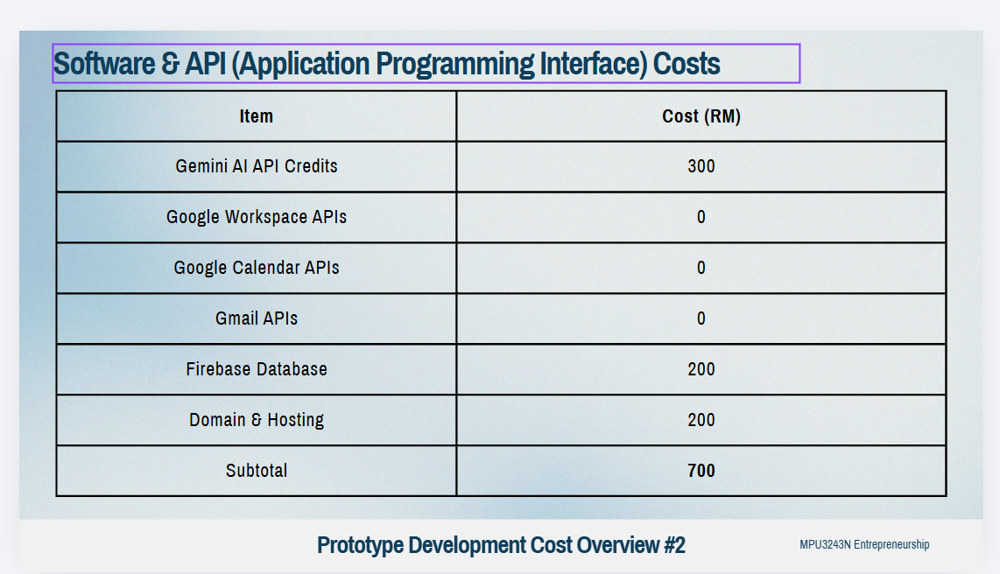

Powered by Gemini AI, ActionPilot AI transforms meeting discussions into actionable tasks, intelligent schedules, and measurable results.

1.LIVE AI MEETING TRANSCRIPTION PROJECT
Automatically records and transcribes meetings in real life or online
Supports multiple languages
Identifies speakers and captures important discussions
Connects to Google Workspace and Zoom Meetings

Benefit: No important information is missed during meetings.

2.SMART MEETING SUMMARIES
Generates meeting summaries instantly and employees can quickly understand meeting outcomes

Benefit: Teams stay aligned and informed with less effort.

3. AI TASK EXTRACTION 

* Automatically identifies tasks from meeting discussions
* Assigns tasks to the correct team members
* Extracts deadlines and responsibilities automatically

Benefit: Every decision becomes a clear task with ownership and accountability.

4. AUTONOMOUS SMART SCHEDULER (MAIN USP)


* Scans Google Calendar and Microsoft 365 calendars
* Finds available focus time automatically
* Schedules tasks into free calendar slots	
* Prevents calendar clashes and missed deadlines

Benefits: Employees receive dedicated time to complete work, not just a task list.

5 AI TASK PRIORITY ENGINE


* Automatically ranks tasks based on urgency, deadlines, and project impact

Benefit: The AI doesn't just schedule work, it schedules the right work first.

6 SEARCH PAST MEETINGS WITH AI


* Search previous meetings using natural language
* Instantly retrieve decisions, tasks, and discussions
* Provides answers in seconds

Benefit: No more searching through recordings, notes, or emails.

7. ACCOUNTABILITY DASHBOARD (USP)


* Tracks department completion rates in real time
* Measures team productivity and time saved

Benefit: Managers and employees gain complete visibility into task execution and team performance.

Security Improved

1. Enterprise-Grade Data Shield (Zero-Retention)
   All meeting transcripts, financial discussions, and intellectual property are processed in a secure, closed loop. Your corporate data is strictly compartmentalized and is never retained or used by the AI provider to train public models.
2. Secure Cloud Backend (Key Isolation)
   Unlike the frontend-only demo, the real app shifts all API keys and core logic into secure server environments (like Firebase Cloud Functions). This ensures that sensitive credentials are never exposed on the user's device or browser.
3. Single Sign-On (SSO) Integration
   Available on the Enterprise tier, this allows corporate clients to manage employee access securely through their existing, centralized identity providers (like Microsoft Azure AD or Google Workspace).
4. Permission-Based Workspace Sync
   The AI’s Smart Scheduler connects to Google Workspace and Microsoft 365 using strict OAuth 2.0 protocols, ensuring it only interacts with the calendar slots and tasks it is explicitly authorized to access, without compromising the wider network.

   Problem Statement

   1. Communication Challenges
   2. Accountability & Task Ownership Issues
   3. Productivity & Time Management Issues
   4. Project Management & Execution Challenges

Industry Trends 

1. Rapid AI Adoption in Malaysia
2. Digital Transformation Growth
3. Growing Enterprise Demand for Productivity Tools
4. Rise of Hybrid Work and Digital Collaboration

   Innovation #1: AI Smart Scheduler

   Existing Approach

   Users manually decide when to complete tasks.

   Our Innovation Includes..

   Gemini AI:

   * Scans calendars
   * Finds available focus time
   * Automatically schedules tasks

   Unique Value

   ActionPilot AI does not just create tasks—it schedules time to complete them.

   **Innovation #2: AI Priority Ranking**

   **Existing Approach**

   **Tasks are displayed equally.**

   **Our Innovation Includes..**

   **Gemini AI evaluates:**

   * **Urgency**
   * **Deadlines**
   * **Project milestones**
   * **Task status**

   **Unique Value**

   The most critical work is automatically prioritized.

   Innovation #3: AI Accountability Dashboard

   **Existing Approach**

   **Managers manually track progress.**

   **Our Innovation Includes**

   * **Completion rates**
   * **Bottleneck detection**
   * **Recovery alerts**
   * **Team statistics**

   **Unique Value**

   **Managers receive real-time visibility into execution performance.

   **Innovation #4: Search Past Meetings**

   **Existing Approach**

   **Employees search through notes or recordings.**

   **Our Innovation**

   **AI search across:**

   * **Meeting transcripts**
   * **Decisions**
   * **Tasks**
   * **Calendar schedules**

   **Unique Value**

   **Instant access to organizational knowledge.

   **Prototype Development Plan**

   **Estimated Time: 12 Weeks**

   **The ActionPilot AI prototype can be fully developed within 12 weeks utilizing highly scalable, existing API technologies:**

   * **Gemini AI API (Logic & Extraction)**
   * **Google Workspace & Calendar API**
   * **Zoom API (Meeting Integration)**
   * **Cloud Database (Secure Storage)**

   **Prototype Scope Deliverables**

   * **Meeting Transcription Engine**
   * **Automated Task Extraction**
   * **AI Smart Scheduler Booking**
   * **Accountability Metrics Dashboard

     
     **

---

## Troubleshooting / Known Issues Log

Problems hit during development, kept here so they're fast to recognize if they recur.

### "Sign-in failed" with no useful detail
**Symptom:** Google sign-in popup closes, generic error shown.
**Cause:** `LoginPage.tsx` was swallowing the real Firebase Auth error and always showing a hardcoded message.
**Fix:** Always surface `(err as Error).message` in the UI instead of a generic string — the real Firebase error code (`auth/popup-blocked`, `auth/unauthorized-domain`, `auth/network-request-failed`, etc.) tells you exactly what's wrong. Check for a blocked-popup icon in the address bar first.

### Dashboard stuck showing "No data yet." with no error
**Symptom:** Page loads, shows the empty state, no console error.
**Cause:** `Promise.all([...]).then(...).finally(...)` with no `.catch()` — a Firestore "missing composite index" error was silently swallowed as an unhandled rejection.
**Fix:** Always add `.catch()` to data-loading promise chains, even ones that "shouldn't" fail. Add any missing composite index to `firestore.indexes.json` and run `firebase deploy --only firestore:indexes`.

### Meetings/Tasks/Dashboard queries return nothing, no error at all
**Symptom:** Data exists in Firestore (visible in the console) but never appears in the app.
**Cause:** Every org-scoped hook guarded with `if (!orgId) return`. An **empty string is falsy in JS**, so when a user's `orgId` was `""` (new users were never forced through onboarding), the fetch silently no-op'd before ever reaching Firestore.
**Fix:** `getOrCreateUserDoc()` now auto-provisions an organization for any user with an empty `orgId`, on every sign-in/session-restore — not just first-time signup. Watch out for this falsy-empty-string trap in any future `if (!someId)` guard.

### Gemini/Workers AI returns `"[object Object]" is not valid JSON`
**Cause:** The Cloudflare Worker did `String(result.response)` on a Workers AI response where `.response` was itself an object, not a string — producing the literal 9-character string `"[object Object]"` which then failed `JSON.parse` downstream.
**Fix:** Check `typeof response === 'string'` before using it directly; `JSON.stringify()` it instead of `String()`-coercing if it's an object, so the round-trip stays valid JSON.

### Cloudflare Worker: secret set but still "API key not valid" locally
**Cause:** `wrangler secret put KEY` only sets the secret for the **deployed/remote** Worker. Local `wrangler dev` (Miniflare) doesn't see it at all — it reads a separate `worker/.dev.vars` file instead.
**Fix:** For local dev, put secrets in `worker/.dev.vars` (gitignored). `wrangler secret put` is still needed before `npm run deploy` for production.
*(No longer applies to Workers AI — we since switched off Gemini's paid API entirely in favor of Workers AI, which needs no key at all.)*

### Google Calendar: `ACCESS_TOKEN_SCOPE_INSUFFICIENT` on freeBusy.query
**Cause:** Requested only the `calendar.events` OAuth scope, which covers creating/editing events but **not** the `freeBusy.query` endpoint used to check availability.
**Fix:** Request the broader `https://www.googleapis.com/auth/calendar` scope instead.

### Whisper transcription always in the wrong language
**Cause:** `@cf/openai/whisper` (the first model used) is English-only and takes `audio` as a raw byte array with no `language` parameter at all.
**Fix:** Switched to `@cf/openai/whisper-large-v3-turbo`, which is multilingual, accepts an explicit `language` param, and expects `audio` as a **base64 string**, not a byte array — different input shape entirely, not just an added field.

### `git push` fails with `Permission ... denied to <account>` (403)
**Cause:** The GitHub account your local git credentials are authenticated as does not have write access to the repo — e.g. Windows Credential Manager has a token for the wrong GitHub account.
**Fix:** Check `Credential Manager → Windows Credentials → git:https://github.com` and confirm it matches the account that actually owns/collaborates on the repo. Either add that account as a collaborator, or clear the stored credential and re-authenticate as the correct one.

### Vite dev server crashes with `EBUSY: resource busy or locked` on Windows
**Symptom:** Happens right after a new dependency is added (e.g. `zustand/middleware`) and Vite needs to re-optimize.
**Cause:** Something (antivirus, OneDrive/Dropbox sync) is holding a lock on files inside `node_modules/.vite` while Vite tries to rewrite them.
**Fix:** Stop the dev server, delete the `node_modules/.vite` cache folder, restart:
```powershell
Remove-Item -Recurse -Force node_modules\.vite
npm run dev
```

### Commits show "Unverified" on GitHub
**Cause:** Commit author/committer email didn't match `noreply@anthropic.com` when Claude made the commit.
**Fix:**
```bash
git config user.email noreply@anthropic.com && git config user.name Claude
git commit --amend --no-edit --reset-author        # for the tip commit
# or, for multiple earlier commits:
git rebase --exec "git commit --amend --no-edit --reset-author" origin/main
```

---

## Feature Decisions / Roadmap

### Live-sync meeting recording (Google Meet / MS Teams) — researched July 2026

**Goal:** click "start record" when a meeting begins, capture all participants' voices (including when the user has earphones in, so their mic doesn't pick up other participants' audio), and transcribe continuously.

**What's free and worth building now — tab/screen audio capture:**
Chrome and Edge support capturing a browser tab's or screen's audio output directly via `getDisplayMedia({ audio: true })` (the same permission prompt used for screen sharing), at no cost and with no third-party service. This captures what's playing in the meeting tab (Google Meet or Teams-in-browser) *before* it reaches the speaker/headphone output, which solves the earphone problem — the app hears other participants regardless of what audio device the user has plugged in. This plugs directly into our existing Whisper pipeline on the Worker with no new infrastructure.
**Limitations:** only reliably works in Chromium browsers (Firefox ignores the audio constraint when sharing a tab; Safari returns no audio track at all), and only captures meetings running in a browser tab — not the native Teams desktop app (would need full-screen + system-audio capture instead, which is far less consistently supported across OSes).
**Decision:** build this — a "Capture meeting tab audio" option alongside the existing mic recording, Chrome/Edge only for now. **Shipped July 2026:** `TabAudioCapture` (New meeting page, "Capture meeting tab" button) uses `getDisplayMedia({ video: true, audio: true })`, immediately stops the video track (only audio is needed), and feeds the resulting audio-only stream through the existing Whisper pipeline. If the user shares a source with no audio track (Firefox/Safari, or they forgot to tick "Share tab audio"), it surfaces a clear error instead of silently transcribing nothing.

**What's not free — and deferred:**
- **Per-speaker diarization** ("who said what"): the standard free/open-source tool is PyAnnote (via WhisperX), but it needs dedicated GPU/CPU inference infrastructure we don't have — Cloudflare Workers AI only exposes fixed hosted models, not custom diarization pipelines. Paid diarization APIs (AssemblyAI, Deepgram, Gladia) exist but conflict with this project's zero-billing architecture.
- **Auto-joining Teams/Google Meet as a bot** (so recording starts without the user needing the meeting open in a tab they control): no free managed option exists — cheapest paid meeting-bot APIs run ~$0.35–0.50/hour (Skribby, Recall.ai). Open-source self-hosted bots (Vexa, Attendee.dev) avoid the per-hour fee but require running and maintaining our own headless-browser server continuously, which is a real infrastructure cost and maintenance burden, not a "free tier" fit.

**Decision:** revisit diarization and auto-join bots only if/when there's budget for paid infra — they're valuable but not achievable inside the current $0 architecture. Tab-audio capture ships now as the practical middle ground.

### Invite / collaboration — shipped July 2026

Orgs can now have more than one member. Admins invite by email (Settings → Members); when the invited email signs in with Google, they're automatically attached to that org with the assigned role instead of getting their own new workspace.

- **Roles:** `owner` (org creator) and `admin` can invite/revoke and manage the workspace; `member` can create/edit meetings and tasks but not manage members or org settings. (`manager` exists in the `UserRole` type but has no distinct permissions yet.)
- **No email delivery:** there's no email-sending backend wired up (would need a Cloud Function + a provider like Resend/SendGrid). Creating an invite just writes a Firestore doc — the admin has to separately tell the invitee which email to sign in with. Revisit if this becomes a real friction point.
- **Data model:** `invites/{orgId}__{email}` — deterministic doc ID so Firestore rules can `get()` it directly to validate a join without needing custom claims or a Cloud Function. Fields: `orgId`, `orgName`, `email`, `role`, `invitedBy`, `status` (`pending` | `accepted` | `revoked`), `createdAt`.
- **Security tightened:** previously any signed-in user could rewrite their *own* `orgId`/`role` fields on their `users/{uid}` doc with no validation (self-elevation to `owner` of any org, or hijacking another org's ID) — `firestore.rules` now only allows changing those fields if either (a) the user owns the organization doc they're pointing at, or (b) there's a matching pending invite for their email/orgId/role. **This changes `firestore.rules` — you must run `firebase deploy --only firestore:rules` for it to take effect in production**, the same as any other rules change.
- `organizations/{orgId}.memberIds` is still not kept in sync when someone joins via invite (pre-existing drift noted above) — membership is authoritative via `users/{uid}.orgId`, not `memberIds`. Fine for now since `listOrgUsers` already queries by `orgId`, not `memberIds`.
